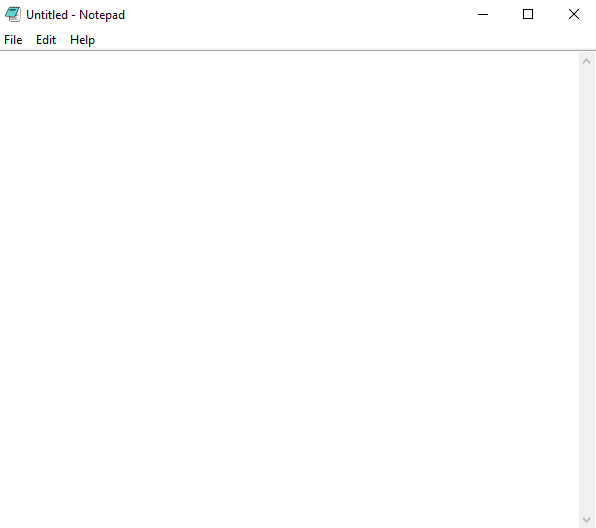

# 📝 Notepad - Tkinter

A basic notepad app using *Python Tkinter GUI* — supports text editing, saving, and file operations.

---

## 🚀 Features

- ✅ Create, Open, Save files  
- 📝 Text editing area with scrollbar  
- 🖱 Menu bar with file options  
- 🎨 Icon support  

---

## 🛠 Technologies Used

- Python 3.x  
- Tkinter (built-in)  

---

## 📸 Screenshot

